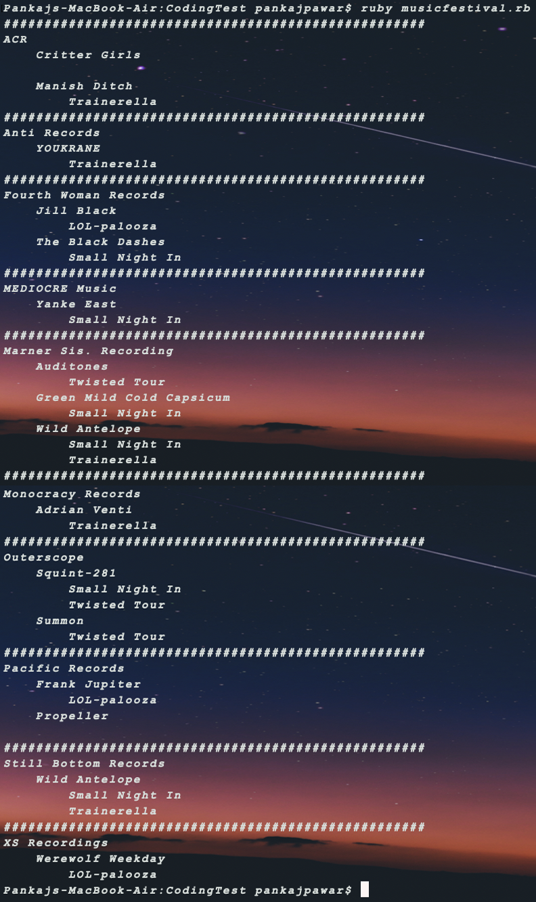

# Coding Test

## The Problem

Your team is tasked with listing out music festival data in a particular manner: at the top level, it should show the band record label, below that it should list out all bands under their management, and below that it should display which festivals they've attended, if any. All entries should be sorted alphabetically.

For example:

* Record Label 1
    * Band X
        * Omega Festival
    * Band Y
* Record Label 2
    * Band A
        * Alpha Festival
        * Beta Festival

The data is provided to you via an API by another team; they assure you all the data is available but it's in a different format and provide you with the Swagger documentation needed to get started.

Use this API as is to output the format specified above in any medium you desire; let it be a website, terminal, file or morse code if that's what you want to do - we just want to see the result somehow.

## Solution

The solution for the above problem is implemented using RUBY.
Make sure, you have ruby installed on your machine.
Also, in order to communicate with the API, a ruby gem called 'httparty' has been used.
In order to install this gem, please type in below command:

```
gem install httparty
```

To run the program, cd into the directory where you have saved the ruby file and type in below command in the terminal:

```
ruby musicfestival.rb
```

## Source Code 

```
# A Ruby gem to get API data
require 'httparty'

# API call to get data
festival_data = HTTParty.get('http://eacodingtest.digital.energyaustralia.com.au/api/v1/festivals')
recordlabel = []

begin
festival_data.each do |data|
  band_data = data["bands"]
  band_data.each do |bdata|
    recordlabel << bdata["recordLabel"]
  end
end
rescue 
  puts "Something went wrong. Please try again."
end

# Storing unique Record Labels in the array and sorting the array alphabetically
recordlabel = recordlabel.compact.reject(&:empty?).uniq.sort

recordlabel.each do |label|
  band = []
  puts "####################################################"
  puts label 
  
    festival_data.each do |data|
      data["bands"].each do |dband|
        if dband["recordLabel"] == label
          band << dband["name"]
        end
      end
    end

    band = band.sort
    band.each do |dband|
      festival = []
      puts "    #{dband}"
      festival_data.each do |fdata|
        fdata["bands"].each do |band|
          if band["name"] == dband
            festival << fdata["name"]
          end
        end
      end

    festival = festival.sort
    festival.each do |fdata|
      puts "        #{fdata}"
    end
  end

end
```

## Sample Output:

